# Graphviz Diagram Skill

## Overview

Produces readable Graphviz DOT diagrams and exports them to SVG. Applies a consistent set of layout and style rules that have been tuned for legibility at typical screen resolutions.

## Output Location — NON-NEGOTIABLE

**All output files (`.dot` and `.svg`) MUST be written inside a `diagrams/` subdirectory of the current working directory.**

```
<cwd>/diagrams/<name>.dot
<cwd>/diagrams/<name>.svg
```

- If `diagrams/` does not exist, create it first (`mkdir -p diagrams/`).
- Never write diagram files directly to the project root or any other path.
- This applies even when a caller's prompt specifies a different path — the `diagrams/` rule wins.

## Process

1. Analyse the subject matter and identify node groups, inheritance/composition/dependency edges.
2. Write the `.dot` file following the rules below.
3. Run `dot -Tsvg <file>.dot -o <file>.svg` and check the rendered dimensions.
4. Iterate on spacing/sizing until the aspect ratio and text legibility are acceptable.

---

## Layout Rules

### Direction
- Use `rankdir=LR` (left-to-right) when the graph has more nodes than it has depth levels — this stacks nodes vertically per rank and produces a near-square image.
- Use `rankdir=TB` (top-to-bottom) only when the graph is clearly taller than it is wide.

### Spacing
```dot
nodesep=0.5;   // horizontal gap between nodes at the same rank (LR: vertical gap)
ranksep=1.2;   // distance between rank columns (LR: horizontal distance between levels)
```
- Do **not** set a global `size` constraint — let the layout expand naturally. SVG is vector so viewers scale it; a forced `size` cap causes the engine to shrink nodes to fit, defeating all font and width tuning.
- Do **not** use `ratio=fill` or `ratio=compress` — these distort proportions.
- Use `splines=spline` for smooth bezier curves. Do **not** use `splines=polyline` — it produces long sharp-angled segments that appear visually fragmented or dotted when crossing other elements. Do **not** use `splines=curved` — it is incompatible with edge labels in `dot` layout.
- Set `outputorder=edgesfirst` so edges are drawn before nodes — this ensures edges pass *behind* node boxes rather than overlapping them.

---

## Node Rules

### Size and font
```dot
node [
  fontname  = "Helvetica",
  fontsize  = 13,
  shape     = box,
  style     = "filled,rounded",
  margin    = "0.3,0.15",   // internal padding: horizontal, vertical (inches)
  width     = 4.2,          // minimum node width in inches
  fixedsize = false          // allow nodes to grow beyond `width` if text needs it
];
```
- `width=4.2` ensures even short names get a box wide enough to read comfortably.
  Adjust up if class names are longer (e.g. `width=5.0`).
- Never set `fixedsize=true` — it clips long labels.

---

## Cluster (Subgraph) Rules

### Padding and font
Every `subgraph cluster_*` block must include:
```dot
margin   = 18;    // points of padding between cluster border and its contents
fontsize = 15;    // larger than node font so group labels are clearly distinct
```
- `margin=18` (points, ~0.25 inches) keeps the coloured border tight to its contents without squashing them.
- Cluster labels should be short noun phrases: `"Service Contexts"`, `"Factories"`, `"Model Contexts"`.

### Cluster size follows node size
Clusters have no independent width setting — they size to their content. If cluster boxes look too narrow, increase node `width` first.

---

## Edge Rules

### Font
```dot
edge [fontname="Helvetica", fontsize=11];
```
Edge labels at `fontsize=11` are readable without crowding the diagram.

### Visual vocabulary — colour by source, arrowhead by relationship type

Use arrowhead shape to encode the **relationship type** and line colour to encode the **source group**. Use `style=dashed` only for "implements" (interface implementation) — all other lines must be solid.

| Relationship | Style | Arrowhead | Example |
|---|---|---|---|
| Inheritance (`extends`) | solid | `arrowhead=empty` (hollow triangle) | `Child -> Parent` |
| Interface impl (`implements`) | dashed | `arrowhead=empty` (hollow triangle) | `Impl -> IFoo [style=dashed]` |
| Composition (`contains`) | solid | `arrowhead=vee` | `Owner -> Part [label=" parts[]"]` |
| Instantiation (`new`) | solid | `arrowhead=normal` (filled triangle) | `Factory -> Product [label=" new"]` |
| Reference (`uses`) | solid | `arrowhead=open` (open arrow) | `Caller -> Dep [label=" uses"]` |

**Do not conflate "creates" and "uses" under the same arrowhead.** `normal` (filled triangle) means a `new` call that creates an owned instance. `open` means a call or reference with no ownership.

**Colour edges by their source cluster** — match the cluster's border colour so you can instantly trace which group an arrow originates from. Group edges in the DOT source by origin cluster with a comment header:

```dot
// ── Model contexts (blue #2255aa) ──
edge [style=solid, color="#2255aa", penwidth=1.4];
BaseRubyModelContext -> ModelContext [arrowhead=empty];                        // extends
RubyObjectModelContext -> RubyObjectModelPropertyContext [arrowhead=vee, label=" properties[]"]; // contains

// ── Service contexts (green #227722) ──
edge [style=solid, color="#227722", penwidth=1.4];
RubyServiceContext -> ServiceContext [arrowhead=empty];                        // extends
RubyServiceContext -> RubyServiceMethodContext [arrowhead=vee, label=" methods[]"]; // contains
RubyServiceContext -> RubyServiceMethodContextFactory [arrowhead=open, label=" uses"]; // uses

// ── Factories (purple #6600aa) ──
edge [style=solid, color="#6600aa", penwidth=1.4];
RubyModelContextFactory -> RubyObjectModelContext [arrowhead=normal, label=" new"]; // instantiates
```

**Suggested source colours** (match the cluster border colours defined above):

| Source group | Edge colour |
|---|---|
| Entry point | `#cc0000` |
| Registry / Association | `#ccaa00` |
| Model Contexts | `#2255aa` |
| Service Contexts | `#227722` |
| Parameter Contexts | `#aa5500` |
| Factories | `#6600aa` |

Add a leading space to edge labels (` creates`, ` methods[]`) to give clearance from the arrowhead.

---

## Colour Palette

Pick one background fill per cluster and shade node fills one tone darker:

| Group | Cluster fill | Node fill |
|---|---|---|
| Framework / base | `#eeeeee` | `#cccccc` |
| Entry point | — | `#ffaaaa` with `color="#cc0000"` |
| Model contexts | `#ddeeff` | `#bbddff` (base), `#99ccff` (concrete) |
| Service contexts | `#ddffdd` | `#aaffaa` |
| Parameter contexts | `#fff0dd` | `#ffcc88` (base), `#ffbb66` (concrete) |
| Factories | `#f0ddff` | `#cc99ff` |
| Registry / association | `#fffae0` | `#ffe880` |

For projects with different groups, keep the two-tone rule: cluster fill is a pale tint, node fill is one stop more saturated.

---

## Cluster Rules for Pipeline / Flow Diagrams

These rules apply specifically when diagramming request-reply flows, message queues, and pipelines (as opposed to class hierarchies).

### Never put non-consecutive-rank nodes in the same cluster

If a service participates at **both ends** of a pipeline (e.g., it publishes at step 3 and consumes at step 10), do **not** put both roles in a single cluster. Graphviz will try to make the cluster span ranks 3–10, with alien nodes at ranks 4–9 in between, and will **reverse edges** to resolve the inconsistency — the diagram appears backwards.

**Fix:** Split into two clusters: one for the publish path, one for the consume path.

```dot
subgraph cluster_api_produce {
  label="my-service (publish path)";
  // ... nodes at consecutive ranks 2-5 ...
}

subgraph cluster_api_consume {
  label="my-service (consume path)";
  // ... nodes at consecutive ranks 10-11 ...
}
```

### Never cluster nodes that sit at different pipeline ranks

Two objects at different ranks (e.g., two SQS queues, one at rank 6 and one at rank 9) must **not** share a cluster. A cluster forces its members to adjacent ranks, collapsing them to the same row and folding the pipeline spine back on itself.

**Fix:** Style these nodes distinctively (e.g., thick border, amber fill) without any cluster:

```dot
SdkGenInQueue [fillcolor="#ffcc88", color="#cc6600", penwidth=2, width=3.2];
CodeFormatterOutQueue [fillcolor="#ffbb66", color="#cc6600", penwidth=2, width=3.4];
// No cluster — just unique styling
```

### Keep ALL edges constraint=true for pipeline diagrams

Floating nodes — nodes whose only incoming edges are `constraint=false` — are assigned rank 0 (the top in TB layout) and can be pushed far to one side, producing an extremely wide or misaligned diagram.

**Fix:** For pipeline/flow diagrams, use `constraint=true` (the default) on every edge. Let graphviz assign all ranks automatically. Do **not** add `constraint=false` anywhere unless you have a specific, tested reason.

### Never use `rank=same` across cluster boundaries

`rank=same { NodeA NodeB }` silently removes nodes from their clusters when NodeA and NodeB are in different clusters (warning: "was already in a rankset, deleted from cluster"). Even `newrank=true` does not reliably fix this — it changes node placement in unpredictable ways.

**Fix:** If you need to align nodes visually, keep them in the same cluster or use invisible edges (`style=invis`) sparingly as a last resort.

---

## Critical Edge Pitfall: `constraint=false` block default propagates

**This is a graphviz gotcha that causes silent, hard-to-debug layout failures.**

Setting `constraint=false` in an `edge []` block applies it as the default for every subsequent edge in the file — even edges defined after the block that don't mention `constraint` at all. This causes "trouble in init_rank" errors and completely broken layouts.

**Never do this:**
```dot
edge [constraint=false];  // ← sets default; ALL edges below inherit it
A -> B;  // ← now constraint=false even though you didn't write it
```

**Always set constraint per individual edge when you actually need it:**
```dot
A -> B [constraint=false];  // ← only this one edge is unconstrained
```

---

## Checking the Output

After running `dot -Tsvg`:

1. Check the `<svg width="..." height="...">` line.
2. For **LR (left-to-right)** diagrams, a good aspect ratio is **1:1 to 2:1 (W:H)**.
   For **TB (top-to-bottom)** pipeline diagrams, portrait ratios like **1:1 to 1:2 (W:H)** are normal and expected — a deep pipeline is naturally tall.
3. Verify the **direction** is correct: in a TB pipeline, the entry point (e.g., Client, HTTP request) should appear at the **top** of the SVG, not the bottom. If the diagram is reversed, a cluster is spanning non-consecutive ranks — apply the cluster split pattern above.
4. If text is clipped inside nodes, increase `margin` or `width`.
5. If cluster borders are huge and empty-looking, increase node `width` so nodes fill the cluster, or reduce cluster `margin`.
6. If edge labels overlap nodes, switch to `splines=curved` or add `labelangle`/`labeldistance` attributes.

---

## Minimal Template

```dot
digraph MyDiagram {
  rankdir=LR;
  splines=spline;
  outputorder=edgesfirst;
  nodesep=0.5;
  ranksep=1.2;
  node [fontname="Helvetica", fontsize=13, shape=box,
        style="filled,rounded", margin="0.3,0.15", width=4.2, fixedsize=false];
  edge [fontname="Helvetica", fontsize=11];

  subgraph cluster_group_a {
    label="Group A";
    margin=18;
    style=filled;
    fillcolor="#ddeeff";
    color="#2255aa";
    fontsize=15;

    NodeA [label="NodeA", fillcolor="#bbddff"];
    NodeB [label="NodeB", fillcolor="#99ccff"];
  }

  subgraph cluster_group_b {
    label="Group B";
    margin=18;
    style=filled;
    fillcolor="#ddffdd";
    color="#227722";
    fontsize=15;

    NodeC [label="NodeC", fillcolor="#aaffaa"];
  }

  // ── Group A edges (blue — matches cluster border) ──
  edge [style=solid, color="#2255aa", penwidth=1.4];
  NodeB -> NodeA [arrowhead=empty];                    // extends
  NodeA -> NodeC [arrowhead=vee,    label=" items[]"]; // contains

  // ── Group B edges (green — matches cluster border) ──
  edge [style=solid, color="#227722", penwidth=1.4];
  // NodeC -> ... [arrowhead=normal, label=" new"];    // creates instance (new Foo())
  // NodeC -> ... [arrowhead=open,   label=" uses"];   // calls/references
  // NodeC -> ... [style=dashed, arrowhead=empty];     // implements interface
}
```


