# Graphviz Diagram Skill

## Overview

Produces readable Graphviz DOT diagrams and exports them to SVG. Applies a consistent set of layout and style rules that have been tuned for legibility at typical screen resolutions.

## Process

1. Analyse the subject matter and identify node groups, inheritance/composition/dependency edges.
2. Write the `.dot` file following the rules below.
3. Run `dot -Tsvg <file>.dot -o <file>.svg` and check the rendered dimensions.
4. Iterate on spacing/sizing until the aspect ratio and text legibility are acceptable.

---

## Layout Rules

### Direction
- Use `rankdir=LR` (left-to-right) when the graph has more nodes than it has depth levels — this stacks nodes vertically per rank and produces a near-square image.
- Use `rankdir=TB` (top-to-bottom) only when the graph is clearly taller than it is wide.

### Spacing
```dot
nodesep=0.5;   // horizontal gap between nodes at the same rank (LR: vertical gap)
ranksep=1.2;   // distance between rank columns (LR: horizontal distance between levels)
```
- Do **not** set a global `size` constraint — let the layout expand naturally. SVG is vector so viewers scale it; a forced `size` cap causes the engine to shrink nodes to fit, defeating all font and width tuning.
- Do **not** use `ratio=fill` or `ratio=compress` — these distort proportions.
- Use `splines=spline` for smooth bezier curves. Do **not** use `splines=polyline` — it produces long sharp-angled segments that appear visually fragmented or dotted when crossing other elements. Do **not** use `splines=curved` — it is incompatible with edge labels in `dot` layout.
- Set `outputorder=edgesfirst` so edges are drawn before nodes — this ensures edges pass *behind* node boxes rather than overlapping them.

---

## Node Rules

### Size and font
```dot
node [
  fontname  = "Helvetica",
  fontsize  = 13,
  shape     = box,
  style     = "filled,rounded",
  margin    = "0.3,0.15",   // internal padding: horizontal, vertical (inches)
  width     = 4.2,          // minimum node width in inches
  fixedsize = false          // allow nodes to grow beyond `width` if text needs it
];
```
- `width=4.2` ensures even short names get a box wide enough to read comfortably.
  Adjust up if class names are longer (e.g. `width=5.0`).
- Never set `fixedsize=true` — it clips long labels.

---

## Cluster (Subgraph) Rules

### Padding and font
Every `subgraph cluster_*` block must include:
```dot
margin   = 18;    // points of padding between cluster border and its contents
fontsize = 15;    // larger than node font so group labels are clearly distinct
```
- `margin=18` (points, ~0.25 inches) keeps the coloured border tight to its contents without squashing them.
- Cluster labels should be short noun phrases: `"Service Contexts"`, `"Factories"`, `"Model Contexts"`.

### Cluster size follows node size
Clusters have no independent width setting — they size to their content. If cluster boxes look too narrow, increase node `width` first.

---

## Edge Rules

### Font
```dot
edge [fontname="Helvetica", fontsize=11];
```
Edge labels at `fontsize=11` are readable without crowding the diagram.

### Visual vocabulary — colour by source, arrowhead by relationship type

Use arrowhead shape to encode the **relationship type** and line colour to encode the **source group**. Use `style=dashed` only for "implements" (interface implementation) — all other lines must be solid.

| Relationship | Style | Arrowhead | Example |
|---|---|---|---|
| Inheritance (`extends`) | solid | `arrowhead=empty` (hollow triangle) | `Child -> Parent` |
| Interface impl (`implements`) | dashed | `arrowhead=empty` (hollow triangle) | `Impl -> IFoo [style=dashed]` |
| Composition (`contains`) | solid | `arrowhead=vee` | `Owner -> Part [label=" parts[]"]` |
| Instantiation (`new`) | solid | `arrowhead=normal` (filled triangle) | `Factory -> Product [label=" new"]` |
| Reference (`uses`) | solid | `arrowhead=open` (open arrow) | `Caller -> Dep [label=" uses"]` |

**Do not conflate "creates" and "uses" under the same arrowhead.** `normal` (filled triangle) means a `new` call that creates an owned instance. `open` means a call or reference with no ownership.

**Colour edges by their source cluster** — match the cluster's border colour so you can instantly trace which group an arrow originates from. Group edges in the DOT source by origin cluster with a comment header:

```dot
// ── Model contexts (blue #2255aa) ──
edge [style=solid, color="#2255aa", penwidth=1.4];
BaseRubyModelContext -> ModelContext [arrowhead=empty];                        // extends
RubyObjectModelContext -> RubyObjectModelPropertyContext [arrowhead=vee, label=" properties[]"]; // contains

// ── Service contexts (green #227722) ──
edge [style=solid, color="#227722", penwidth=1.4];
RubyServiceContext -> ServiceContext [arrowhead=empty];                        // extends
RubyServiceContext -> RubyServiceMethodContext [arrowhead=vee, label=" methods[]"]; // contains
RubyServiceContext -> RubyServiceMethodContextFactory [arrowhead=open, label=" uses"]; // uses

// ── Factories (purple #6600aa) ──
edge [style=solid, color="#6600aa", penwidth=1.4];
RubyModelContextFactory -> RubyObjectModelContext [arrowhead=normal, label=" new"]; // instantiates
```

**Suggested source colours** (match the cluster border colours defined above):

| Source group | Edge colour |
|---|---|
| Entry point | `#cc0000` |
| Registry / Association | `#ccaa00` |
| Model Contexts | `#2255aa` |
| Service Contexts | `#227722` |
| Parameter Contexts | `#aa5500` |
| Factories | `#6600aa` |

Add a leading space to edge labels (` creates`, ` methods[]`) to give clearance from the arrowhead.

---

## Colour Palette

Pick one background fill per cluster and shade node fills one tone darker:

| Group | Cluster fill | Node fill |
|---|---|---|
| Framework / base | `#eeeeee` | `#cccccc` |
| Entry point | — | `#ffaaaa` with `color="#cc0000"` |
| Model contexts | `#ddeeff` | `#bbddff` (base), `#99ccff` (concrete) |
| Service contexts | `#ddffdd` | `#aaffaa` |
| Parameter contexts | `#fff0dd` | `#ffcc88` (base), `#ffbb66` (concrete) |
| Factories | `#f0ddff` | `#cc99ff` |
| Registry / association | `#fffae0` | `#ffe880` |

For projects with different groups, keep the two-tone rule: cluster fill is a pale tint, node fill is one stop more saturated.

---

## Checking the Output

After running `dot -Tsvg`:

1. Check the `<svg width="..." height="...">` line.
2. A good aspect ratio is roughly **1:1 to 2:1 (W:H)**. Much wider than 2:1 means too many nodes are on the same rank — consider splitting clusters or switching `rankdir`.
3. If text is clipped inside nodes, increase `margin` or `width`.
4. If cluster borders are huge and empty-looking, increase node `width` so nodes fill the cluster, or reduce cluster `margin`.
5. If edge labels overlap nodes, switch to `splines=curved` or add `labelangle`/`labeldistance` attributes.

---

## Minimal Template

```dot
digraph MyDiagram {
  rankdir=LR;
  splines=spline;
  outputorder=edgesfirst;
  nodesep=0.5;
  ranksep=1.2;
  node [fontname="Helvetica", fontsize=13, shape=box,
        style="filled,rounded", margin="0.3,0.15", width=4.2, fixedsize=false];
  edge [fontname="Helvetica", fontsize=11];

  subgraph cluster_group_a {
    label="Group A";
    margin=18;
    style=filled;
    fillcolor="#ddeeff";
    color="#2255aa";
    fontsize=15;

    NodeA [label="NodeA", fillcolor="#bbddff"];
    NodeB [label="NodeB", fillcolor="#99ccff"];
  }

  subgraph cluster_group_b {
    label="Group B";
    margin=18;
    style=filled;
    fillcolor="#ddffdd";
    color="#227722";
    fontsize=15;

    NodeC [label="NodeC", fillcolor="#aaffaa"];
  }

  // ── Group A edges (blue — matches cluster border) ──
  edge [style=solid, color="#2255aa", penwidth=1.4];
  NodeB -> NodeA [arrowhead=empty];                    // extends
  NodeA -> NodeC [arrowhead=vee,    label=" items[]"]; // contains

  // ── Group B edges (green — matches cluster border) ──
  edge [style=solid, color="#227722", penwidth=1.4];
  // NodeC -> ... [arrowhead=normal, label=" new"];    // creates instance (new Foo())
  // NodeC -> ... [arrowhead=open,   label=" uses"];   // calls/references
  // NodeC -> ... [style=dashed, arrowhead=empty];     // implements interface
}
```


